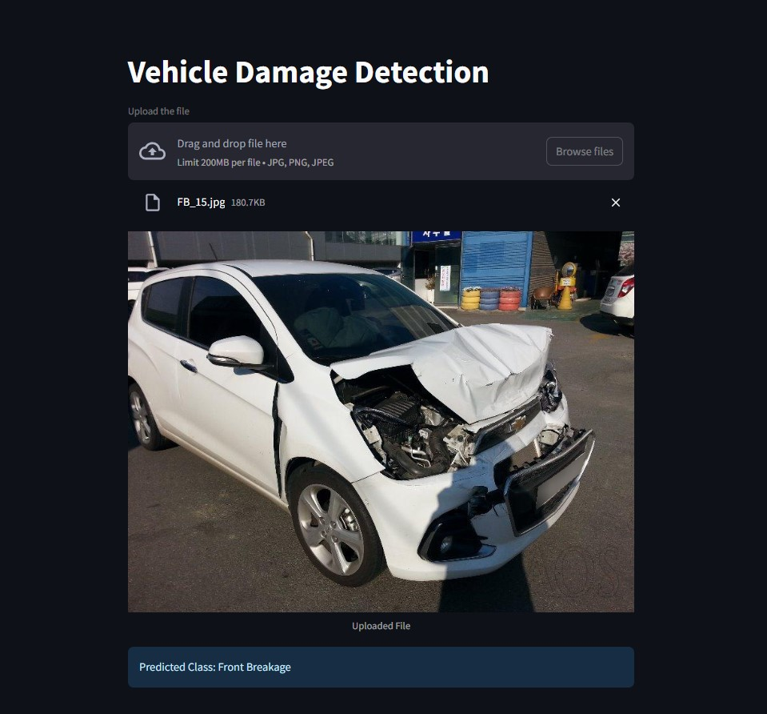

# 🚗 Vehicle Damage Classification using Deep Learning

This project is my implementation of a vehicle damage classification system using deep learning, based on the paper:

> **Donggeun Lee, Juyeob Lee, Eunil Park**  
> *Automated vehicle damage classification using the three-quarter view car damage dataset and deep learning approaches*  
> DOI: [10.1016/j.heliyon.2024.e34016](https://doi.org/10.1016/j.heliyon.2024.e34016)  
> [Read the full article](https://www.sciencedirect.com/science/article/pii/S2405844024100473)

---

## 📘 Project Overview

I developed a deep learning-based proof of concept (POC) to classify car damage using images taken from a **three-quarter view**. The goal was to accurately detect and categorize vehicle damage into six categories based on the front or rear view.

This project includes:
- ✅ A **ResNet50-based** classification model
- ✅ A **FastAPI** backend server
- ✅ A **Streamlit** frontend app for uploading and predicting images
- ✅ Support for real-time damage detection via image uploads

---

## 🧠 Classes Predicted

The model predicts six classes:

1. Front Normal  
2. Front Breakage  
3. Front Crushed  
4. Rear Normal  
5. Rear Breakage  
6. Rear Crushed

---

## 🎯 Objectives

- Develop a classification model with **at least 75% accuracy**
- Build a user-friendly interface to upload car images
- Enable real-time prediction via REST API and frontend

---

## 🧰 Tech Stack

- 🧠 Model: `ResNet50` (Transfer Learning)
- 🐍 Language: `Python 3.10+`
- 🌐 Backend: `FastAPI`
- 🎛️ Frontend: `Streamlit`
- 📦 Others: `TensorFlow`, `NumPy`, `OpenCV`, `Pillow`

---

## 🚀 Getting Started

### 1️⃣ Clone the Repository

```bash
      git clone https://github.com/your-username/car-damage-classification.git
      cd car-damage-classification
```
### 2️⃣ Install Requirements

```bash
   pip install -r requirements.txt
```
### 3️⃣ Run the FastAPI Backend

```bash
  uvicorn server:app --reload
```
### 4️⃣ Run the Streamlit App

```bash
  streamlit run app.py
```
You can now drag and drop an image into the interface to receive real-time damage predictions.

### 📊 Model Performance

- Model: ResNet50

- Training Size: ~1700 images

- Validation Accuracy: ~80%

- Loss Function: Categorical Crossentropy

- Optimizer: Adam

- Data Augmentation: Horizontal flip, rotation, zoom, etc.

### 📸 Screenshots

#### 📂 Upload Image UI (Streamlit)


### 🌐 Live Demo 
> DOI: [10.1016/j.heliyon.2024.e34016](https://doi.org/10.1016/j.heliyon.2024.e34016)  

### 🗂️ Folder Structure

``` bash
    .
├── app.py                # Streamlit frontend
├── server.py             # FastAPI backend
├── model/                # Trained model weights
├── model_helper.py              # Helper functions
├── requirements.txt
└── README.md

```

### 📚 Citation

If you use this project, please cite the dataset and paper:

Lee, D., Lee, J., & Park, E. (2024).
Automated vehicle damage
classification using the three-quarter view car damage dataset and deep learning approaches. Heliyon, e34016.
https://doi.org/10.1016/j.heliyon.2024.e34016

### 👋 About Me
I am currently pursuing a Master’s in Data Science and passionate about computer vision applications. This project helped me explore the end-to-end ML lifecycle, from training to deployment.

- Author: Kattunga Dinesh Kumar Raju

### 📖 License
- This repository is for academic and non-commercial research purposes only.

- The dataset used is distributed under the license mentioned by the authors of the original paper.

